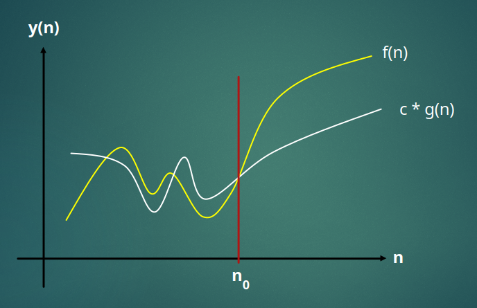
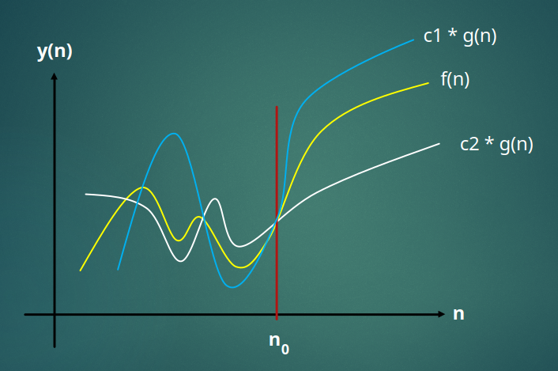

# Algorithm running time

- Commonly there is a trade off between memory complexity and running time complexity
  - The more memory you commit, the less time it should take to run an algorithm
  - However, if you need to save memory as a critical requirement, this will increase the running time
- This is not generally considered to be an accurate measurement of an algorithms true running time
  - This is hardware dependent
  - e.g., it will run faster on a powerful computer than it would on a phone
- The **number of steps** is a better way to gauge running time
  - More generic and machine independent
  - When measuring this way, the **number of items** is what is taken into account
  - This is known as the **input size**
- Quick example. Say an algorithm processing 100 items takes ~100ms to complete:
  - Ideally the same algorithm processing 1000 items should take ~1000ms
    - This is **linear O(N)** time complexity
  - What if the same algorithm processes 1000 items in ~100000ms?
    - This is **quadratic O(N^2)** time complexity
- This example shows the time by way of demonstrating the relationship between the number of items and processing time. Actual time would still be machine dependent so we don't care about it, the input size is the most important

# Big (O) Ordo

- Landau notation
- Describes the **limiting behaviour of a function when the argument grows towards infinity**
- Classifies algorithms by how they respond to changes in input size **N**
- Big O cares about **Asymptotic Analysis**
  - Seeing what happens when **N** becomes very large
  - Known as the **upper bound** of the algorithm

 

$f(n) = O(g(n))$

 

- This equation is requires that there is
  - some constant $c$ &gt; $0$
  - some threshold $n_0$ &gt; $0$
- and that
  - when $n$ &gt; $n_0$ then $f(n)$ &lt; $c * g(n)$
  - $c * g(n)$ is the **upper bound** of $f(n)$ and is denoted by $O(g(n))$
  - This make $O(g(n))$ the **worst case scenario**
- Now Ordo is defined as:

 

$O = | f(n) |$ &leq; $c * |g(n)|$

 

- This reads:
  - O equals the absolute value of f of n when it is less than or equal to the absolute value of g of n
  - **O is our running time**

- The area $n$ &lt; $n_0$ is not interesting to us
- **Big O cares about what happens to very large values of N**

# Big ($\Omega$) Omega

- This is mathematically similar to $O(N)$ but defines the inverse
- Now we are defining the **lower bound** of the algorithm
- This can be thought of as the **best case scenario**

 

$f(n) = \Omega(g(n))$

 

# Big ($\theta$) Theta

- This defines both the concepts above
- We can say that $f(n) = \theta(g(n))$ when
  - $c_1$ $,$ $c_2$ &gt; $0$
  - $n$ &gt; $n$0
  - $f(n)$ &lt; $c_1$ $*$ $g(n)$
  - $f(n)$ &gt; $c_2$ $*$ $g(n)$

# Examples

### Big O

- Consider the function:

 

$f(n) = 3n^2-100n+6$

 

- To satisfy $O(n^2)$ we need to prove that $3n^2-100n + 6$ &lt; $c * n^2$
- Let's say that
  - $n_0$ $= 34$
- Lets find the range of constants $c$ that can satisfy this bound

 

$3n^2 -100n + 6$ &lt; $c * n^2$
 
$100n + 6$ &lt; $c * n^2 + 3n^2$
 
$100n + 6$ &lt; $n^2(c + 3)$
  
$\frac{100n + 6}{n^2}$ &lt; $c - 3$
  
$100/n + 6/n^2 + 3$ &lt; c
 
$c$ &geq; $100/34 + 6/34^2 + 3$

- Remove the $+ 3$ and round the fractions

$c$ &geq; $3 + 0$
 
$c$ &geq; $3$

- We can say that for threshold $n$ &gt; $34$, $c$ must be greater than or equal to 3 to be an upper bound of $O(n^2)$

### Big ($\Omega$) Omega

- Using the same function for $f(n)$ as in the example above

 

$f(n) = 3n^2 - 100n +6$

 

- To satisfy $\Omega(n^2)$ we need to prove that $c * n^2$ &lt; $3n^2 - 100n + 6$
- Let's say that
  - $n_0$ $= 34$
- Lets find the range of constants $c$ that can satisfy this bound

 

$c * n^2$ &lt; $3n^2 -100n + 6$
  
$c$ &lt; $\frac{3n^2 -100n + 6}{n^2}$
  
$c$ &lt; $3 - 100/n + 6/n^2$

- Remove the $+ 3$ and round the fractions

$c$ &lt; $3 + 0$
 
$c$ &lt; $3$

- We can say that for threshold $n$ &gt; $34$, $c$ must be less than 3 to be a lower bound of $\Omega(n^2)$
