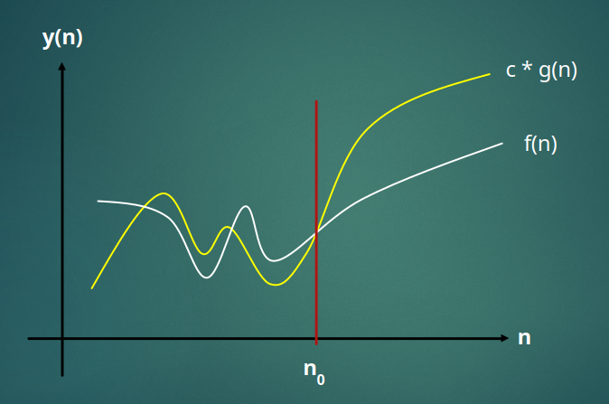

# Algorithm running time

- Commonly there is a trade off between memory complexity and running time complexity
  - The more memory you commit, the less time it should take to run an algorithm
  - However, if you need to save memory as a critical requirement, this will increase the running time
- This is not generally considered to be an accurate measurement of an algorithms true running time
  - This is hardware dependent
  - e.g., it will run faster on a powerful computer than it would on a phone
- The **number of steps** is a better way to gauge running time
  - More generic and machine independent
  - When measuring this way, the **number of items** is what is taken into account
  - This is known as the **input size**
- Quick example. Say an algorithm processing 100 items takes ~100ms to complete:
  - Ideally the same algorithm processing 1000 items should take ~1000ms
    - This is **linear O(N)** time complexity
  - What if the same algorithm processes 1000 items in ~100000ms?
    - This is **quadratic O(N^2)** time complexity
- This example shows the time by way of demonstrating the relationship between the number of items and processing time. Actual time would still be machine dependent so we don't care about it, the input size is the most important

# Big (O) Ordo

- Landau notation
- Describes the **limiting behaviour of a function when the argument grows towards infinity**
- Classifies algorithms by how they respond to changes in input size **N**
- Big O cares about **Asymptotic Analysis**
  - Seeing what happens when **N** becomes very large
  - Known as the **upper bound** of the algorithm

${f(n) = O(g(n))}$

- This equation is stating that there is
  - some constant ${c > 0}$
  - some threshold ${n}$0 ${> 0}$
- and that
  - when ${n > n}$0 then ${f(n)} < {c * g(n)}$
  - ${c * g(n)}$ is the **upper bound** ${f(n)}$

- The area ${n < n}$0 is not interesting to us
- **Big O cares about what happens are large values of N**

# Big ($\Omega$) Omega

# Big ($\theta$) Theta
